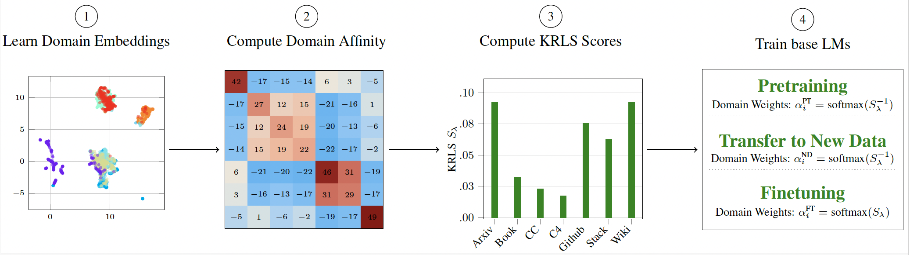

# CHAMELEON: A Flexible Data-mixing Framework for Language Model Pretraining and Finetuning

This is the official code for [CHAMELEON: A Flexible Data-mixing Framework for Language Model Pretraining and Finetuning]() accepted at ICML 2025.




CHAMELEON is an efficient, data-centric framework that leverages Kernel Ridge Leverage Scores (KRLS) to quantify domain representativeness from embedded data. Inverse KRLS-based domain weights are used to emphasize general knowledge during pretraining, while KRLS-based weights are employed to highlight domain-specific uniqueness during finetuning.

CHAMELEON addresses three key challenges in data mixing:
- **Universal Generalization:** It aims to improve universal generalization, which is a fundamental goal of domain reweighting.
- **Adaptability to Domain Modifications:** The framework can adapt to domain modifications, a crucial feature given that data naturally evolves between preparation and LLM training.
- **Handling Different Training Stages:** It handles different training stages, including both pretraining and fine-tuning.


## Setup
```
conda create -n chameleon python=3.8
conda activate chameleon

# On GPU
conda install pytorch torchvision torchaudio pytorch-cuda=12.1 -c pytorch -c nvidia

pip install -r requirements.txt
```

## Domain Weights

Domian weights of Slimpajama can be extracted by `domain_weights.py`. Note that we use Slimpajama-6b dataset as an example here.

### Key Concepts

* **Domain Embeddings**: Vector representations of data domains, capturing semantic/structural information, extracted from a small proxy language model.
* **Domain Affinity Matrix**: A matrix built from domain embeddings, showing pairwise relationships and semantic similarities between domains.
* **Kernel Ridge Leverage Scores (KRLS)**: Quantify each domain's influence or uniqueness.
    * **Inverse KRLS (Pretraining)**: Upweights common representations for general knowledge.
    * **KRLS (Finetuning)**: Emphasizes unique, domain-specific data for specialization.


### Compute Domain Weights
You will need a pre-trained proxy model. Specify the path to its directory with the `--checkpoint_path` argument.

To calculate weights for the **pretraining** phase
```
python compute_chameleon_weights.py --mode pretrain
```

To calculate weights for the **finetuning** phase

```
python compute_chameleon_weights.py --mode finetune
```

Other configuration:

- `--checkpoint_path`: Path to your proxy model checkpoint. Defaults to `./checkpoints/BASE-82M/`.
- `--embeddings_dir`: Directory to save/load computed domain embeddings. Defaults to `./embeddings/`.
- `--lambda_reg`: Regularization parameter for KRLS.
- `--ft_temperature`: Temperature for finetuning softmax.
- `--pt_temperature`: Temperature for pretraining softmax.
- `--num_samples`: Number of random samples per domain for embedding.
- `--embedding_batch_size`: Batch size for computing embeddings to manage GPU memory.
- `--sample_length`: Length (in tokens) of each sample.
- `--skip_embedding_generation`: If set, the script will skip generating new embeddings and try to load existing ones from `--embeddings_dir`.


## Training LLMs

CHAMELEON generates domain weights that dictate the proportion of data from each domain to be used during language model training. To actually train large language models using these computed weights, we leverage existing, established training codebases.

Specifically, our experiments utilize modifications of the following repositories:

* **DoGE**: both proxy and base model training.
    * Repository: `https://github.com/Olivia-fsm/DoGE`
* **RegMix**: obtaining RegMix domain weights on SlimPajama.
    * Repository: `https://github.com/sail-sg/regmix`


<!-- ## Citation
```
@inproceedings{xie2024sampa,
  title={{SAMPa}: Sharpness-aware Minimization Parallelized},
  author={Xie, Wanyun and Pethick, Thomas and Cevher, Volkan},
  booktitle={Advances in Neural Information Processing Systems (NeurIPS)},
  year={2024}
}
```  -->